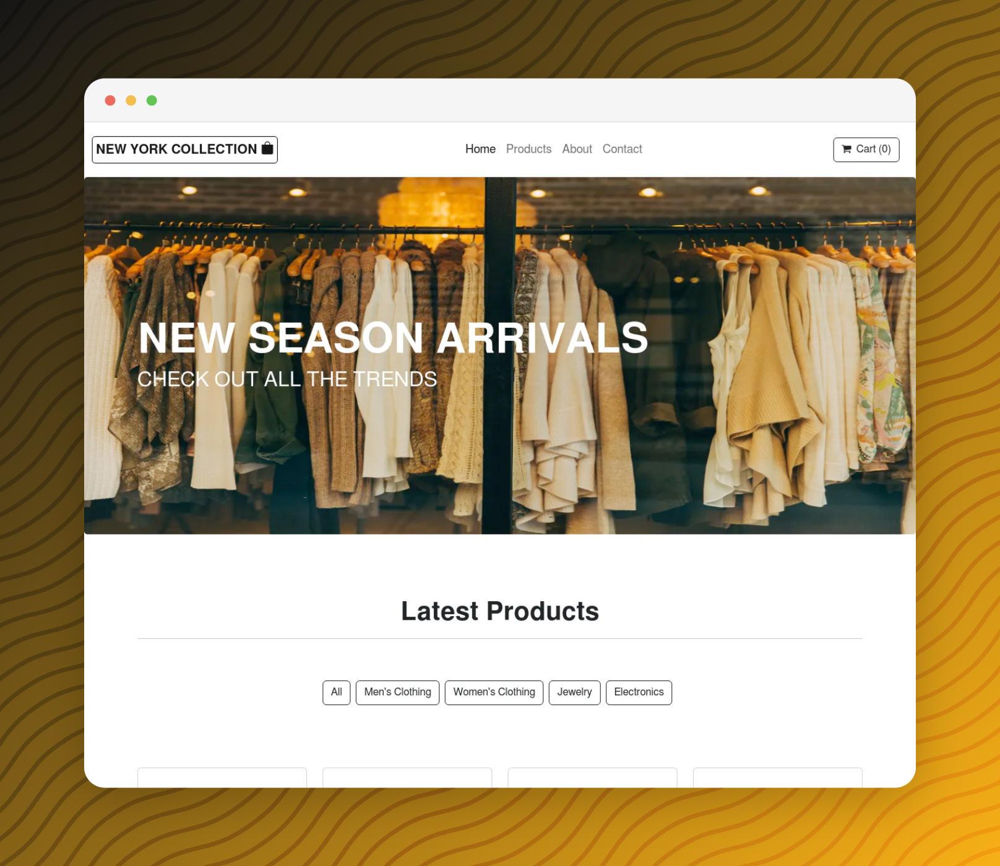

<p align="center">
  
</p>

<h1 align="center">New York Collection</h1>
<p align="center">
  Check out the hottest new styles this Season!
</p>

## Server Implementations

This project includes two server implementations that provide the same functionality:

### Node.js Server (Original)

The original server implementation using Express.js:

```bash
# Install dependencies
npm install

# Run the server
node server.js
```

### FastAPI Server (New)

A Python implementation using FastAPI framework:

```bash
# Create and activate virtual environment (optional but recommended)
python -m venv .venv
source .venv/bin/activate  # On Windows: .venv\Scripts\activate

# Install dependencies
pip install -r requirements.txt

# Run the server
python -m uvicorn main:app --reload --port 3000
```

## Features

- Product browsing and shopping cart functionality
- Stripe integration for payment processing
- RESTful API endpoints
- Static file serving for the React frontend

## Configuration

Both implementations use the same configuration files:

- `config/.env.local` - Environment variables including Stripe API keys
- `fakeToStripe.json` - Mapping of product IDs to Stripe price IDs
